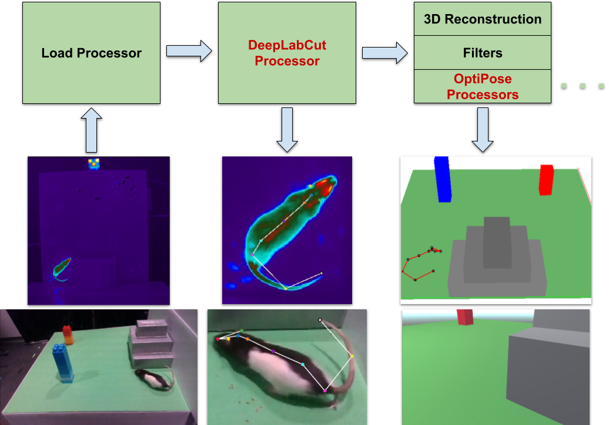

# BU-CVKit : Extendable Computer Vision Framework

## Installation
```shell
conda create -n cvkit python=3.10 cudatoolkit
conda activate cvkit

#Follow from Steup 2: Tensorflow website https://www.tensorflow.org/install/pip#linux (linux configuration)
#Ignore version numbers
 
pip install bu-cvkit
```

## Abstract

A major bottleneck of interdisciplinary computer vision research is the lack of a framework that eases the reuse and abstraction of state-of-the-art CV methods.
We present here BU-CVKit framework, which bridges the accessibility gap to state-of-the-art computer vision research for researchers from diverse backgrounds and application disciplines.
The core idea behind BU-CVKit is to provide chainable `Processors` that can be used to create abstract research pipelines which can be easily modified and shared with the community.
These pipelines can be interpreted as a black box that performs semantically meaningful computations on the input data.
The community can create plugins of their work for the framework, hence improving the re-usability, accessibility, and exposure of their work with minimal overhead.
Furthermore, we provide [MuSeqPose Kit](https://mahir1010.github.io/MuSeqPose/), a user interface for the pose estimation package of BU-CVKit, which automatically scans for installed plugins and programmatically generates an interface.


## Pose Estimation Features

### Data I/O Modules

The framework provides an abstract [`DataStoreInterface`](https://bu-cvkit.readthedocs.io/en/latest/cvkit.pose_estimation.data_readers.html#cvkit.pose_estimation.data_readers.datastore_interface.DataStoreInterface) class that can be extended to provide intuitive access to n-dimensional pose estimation data.
Each instance of a person’s or animal’s pose is converted into a [`Skeleton`](https://bu-cvkit.readthedocs.io/en/latest/cvkit.pose_estimation.html#cvkit.pose_estimation.skeleton.Skeleton) object which in turn contains multiple [`Part`](https://bu-cvkit.readthedocs.io/en/latest/cvkit.pose_estimation.html#cvkit.pose_estimation.skeleton.Part) Objects.
Each Part object extends a Numpy array and therefore supports efficient vectorized operations.
In addition, the Skeleton object supports further Pose-Estimation-specific features such as behavior annotations and unified arithmetic and geometric operations.

<p align="center"></p>

#### Part Class
It represents a single marker or a body part of the animal. Internally it is represented by n-dimensional `numpy` array. Therefore, it supports wide range of computational methods provided by the numpy library.
The validity of a `Part` instance is defined by its `likelihood' $\in [0.0,1.0]$ value.

Example:
```python
from cvkit.pose_estimation.skeleton import Part
import numpy as np

mouse_1_snout = Part([200,300,50],'snout',1.0) # (n-dimensional list/array, name, likelihood)
mouse_2_snout = Part([100,100,40],'snout',0.7)

# Euclidean distance between mouse 1 and mouse 2
print(mouse_1_snout.distance(mouse_2_snout))

# Magnitude of the position vector
magnitude_1 = mouse_1_snout.magnitude()
# or 
magnitude_2 = np.linalg.norm(mouse_2_snout)

# Vector from mouse 1 to mouse 2
vector_12 = mouse_2_snout - mouse_1_snout

# uniformly scale mouse 1
mouse_1_snout = mouse_1_snout * 2

# non-uniformly scale mouse 2
mouse_2_snout = mouse_2_snout * [1,2,1]

# You can check the likelihood of the data by either accessing likelihood attribute
# or by directly comparing the Part object
is_mouse_1_valid = mouse_1_snout.likelihood > 0.7
# or
is_mouse_2_valid = mouse_2_snout > 0.7


```
#### Skeleton Class

It represents the complete skeleton of the tracked subject. For an experiment with $n$ keypoints, a [`Skeleton`](https://bu-cvkit.readthedocs.io/en/latest/cvkit.pose_estimation.html#cvkit.pose_estimation.skeleton.Skeleton) object will contain $n$ instances of [`Part`](https://bu-cvkit.readthedocs.io/en/latest/cvkit.pose_estimation.html#cvkit.pose_estimation.skeleton.Part) objects.
The Skeleton class provides encapsulation to all the body parts of the same animal. You can uniformly process all parts at the same time. It also contains behaviour information for current skeleton orientation.

Example:
```python
from cvkit.pose_estimation.skeleton import Skeleton

body_parts = ['snout','headBase']
data_map_1 = {'snout':[200,300,50],'headBase':[200,270,100]}
likelihood_map_1 = {'snout':0.7,'headBase':0.8}
current_behaviours = ['rearing']

# Skeleton at t = 0
# (list of bodyparts, data dictionary, likelihood dictionary, behaviour list (default empty), dimensions (default 3)
skeleton_1 = Skeleton(body_parts,data_map_1,likelihood_map_1,current_behaviours)

data_map_2 = {'snout':[100,300,50],'headBase':[100,270,100]}
likelihood_map_2 = {'snout':0.7,'headBase':0.8}

# Skeleton at t = 1
skeleton_2 = Skeleton(body_parts,data_map_2,likelihood_map_2)

# Displacement
displacement = skeleton_2 - skeleton_1
print(displacement['snout'],displacement['headBase'])

#Head Direction
head_direction = skeleton_1['snout'] - skeleton_1['headBase']

#Support broadcast operations
skeleton_1 = skeleton_1 + [10,20,-5]    # non-uniform translation
skeleton_1 = skeleton_1 + 5             # uniform translation
skeleton_1 = skeleton_1 * 2             # uniform scaling 
skeleton_1 = skeleton_1 * [0.5,1,0.5]   # non-uniform scaling

#Supports elementwise operations
skeleton_3 = skeleton_1 + skeleton_2
skeleton_3 = skeleton_1 * skeleton_2

#Normalize skeleton between 0 and 1.0
min_coordinates = [0,0,0] # Define minimum coordinate values
max_coordinates = [1000,1000,500] # Define maximum coordinate values
skeleton_1 = skeleton_1.normalize(min_coordinates,max_coordinates)


```


As of now, we have released 3 implementation of the [`DataStoreInterface`](https://bu-cvkit.readthedocs.io/en/latest/cvkit.pose_estimation.data_readers.html#cvkit.pose_estimation.data_readers.datastore_interface.DataStoreInterface).
1. [`CVKitDataStore3D`](https://bu-cvkit.readthedocs.io/en/latest/cvkit.pose_estimation.data_readers.html#cvkit.pose_estimation.data_readers.cvkit_datastore.CVKitDataStore3D) : Our n-dimensional data interface that stores list of coordinates per cell in a csv file. 
2. [`DeeplabcutDataStore`](https://bu-cvkit.readthedocs.io/en/latest/cvkit.pose_estimation.data_readers.html#cvkit.pose_estimation.data_readers.deeplabcut_datastore.DeeplabcutDataStore) : Following the data structure of [DeepLabCut](https://github.com/DeepLabCut/DeepLabCut),  a feature-rich pose-estimation toolkit widely used in the research community.
3. [`FlattenedDataStore`](https://bu-cvkit.readthedocs.io/en/latest/cvkit.pose_estimation.data_readers.html#cvkit.pose_estimation.data_readers.flattened_datastore.FlattenedDataStore) : n-dimensional data interface that flattens all dimensions to separate csv cells. 

Example:
```python
from cvkit.pose_estimation.data_readers import CVKitDataStore3D

body_parts = ['snout','leftEar','rightEar','headBase','sp1','mid','sp2','tailBase','tailMid','tailTip']
data_store = CVKitDataStore3D(body_parts,'<path_to_file>')
# Random Access
# Get Skeleton object from data_store for the 100th frame
skeleton = data_store.get_skeleton(100)
head_direction = skeleton['snout'] - skeleton['headBase']

# You can access individual parts too!
head_direction = data_store.get_part(100,'snout') -  data_store.get_part(100,'headBase')

# Sequential Access
for index,skeleton in data_store.row_iterator():
    body_direction = skeleton['headBase'] - skeleton['tailBase']
    print(body_direction)

for index,part in data_store.part_iterator('snout'):
    if part.likelihood < 0.8:
        print(f'{part} Potentially inaccurate data point!')

# Part object also supports comparisons
condition = skeleton['snout'] < skeleton['headBase']
# Equivalent to 
condition = skeleton['snout'].likelihood < skeleton['headBase'].likelihood


```

### Efficient Video Readers


BU-CVKit contains an abstract buffered VideoReader class that can be extended to provide sequential or random access to video frames using different backbone libraries.
With our package, we provide buffered implementation of [OpenCV](https://github.com/opencv/opencv-python), [Deffcode](https://github.com/abhiTronix/deffcode),
[Decord](https://github.com/dmlc/decord), and an Image plugin, which supports reading a directory of images and providing them as a video stream to support the data format adopted by the datasets.
The figure shows performance for single stream sequential read performance on a standard computer. However, the buffered VideoReaders inherently use multi-threading to fill buffers, 
therefore a performance improvement can be noticed while reading multiple streams parallely.


Example:
```python
from cvkit.video_readers import CV2VideoReader

#(file_path, fps, buffer_size)
reader = CV2VideoReader('<path>',60,256)

print(f'The video has {reader.get_number_of_frames()} frames!!')
reader.start()
#Get First Frame as numpy array hxwxc RGB format
frame = reader.next_frame()
print(reader.get_current_index()) # Index 0
#Seek 100th frame
reader.seek_pos(100) #Automatically manages buffer in the background
frame = reader.next_frame()
print(reader.get_current_index())# Index 100

#Random access image without affecting the current index or the buffer 
frame = reader.random_access_image(200)
print(reader.get_current_index())# Index 100
# The performance of random access depends upon underlying library. 


```

### Processor Modules


The pose estimation package provides an abstract `Processor` class that can be extended to implement plugins for state-of-the-art computer vision methods.
The instances of these Processors are chainable and, therefore, can be used to create a pipeline that takes raw data and generate the desired output.
<p align="center"></p>

We classify `Processor` objects into three categories:
1. Generative : Processor that performs some computational task to generate data files.
2. Filters : Processor that takes `DataStoreInterface` as input and performs any kind of data filtering computation.
3. Utility : Processor that provides utility functions to facilitate chaining operations.


Example:
<p align="center"></p>

```python
from cvkit.pose_estimation.processors.util import LoadFile,SaveFile,ClusterAnalysis
from cvkit.pose_estimation.processors.filter import LinearInterpolationFilter,KalmanFilter
from cvkit.pose_estimation.config import PoseEstimationConfig

#Load data store
body_parts = ['snout','leftEar','rightEar','headBase','sp1','mid','sp2','tailBase','tailMid','tailTip']
path_to_file = '<path_to_file>'
threshold = 0.6 # Cutoff for considering data as invalid
config = PoseEstimationConfig('<path_to_yaml>') #Contains Experiment Metadata (body parts, video/data paths, etc..) 

processors = [
    LoadFile(config,{'path':path_to_file,'type':'CVKit3D'}), #Loads given file as CVKit3D data
    ClusterAnalysis(threshold), #Analyzes file to compute clusters of accurate and inaccurate data. Used by interpolation to skip accurate data points.
    LinearInterpolationFilter('snout',threshold,10), # (target_column,threhsold,max_window_size)
    KalmanFilter('snout',60), # (target_column,framerate)
    SaveFile('<output_file_path>') #Saves File at output_file_path
]

data_store = None
for processor in processors:
    processor.process(data_store)
    data_store = processor.get_output() #Overwrite data_store and forward to next processor.
```


### [Documentation](https://bu-cvkit.readthedocs.io)
